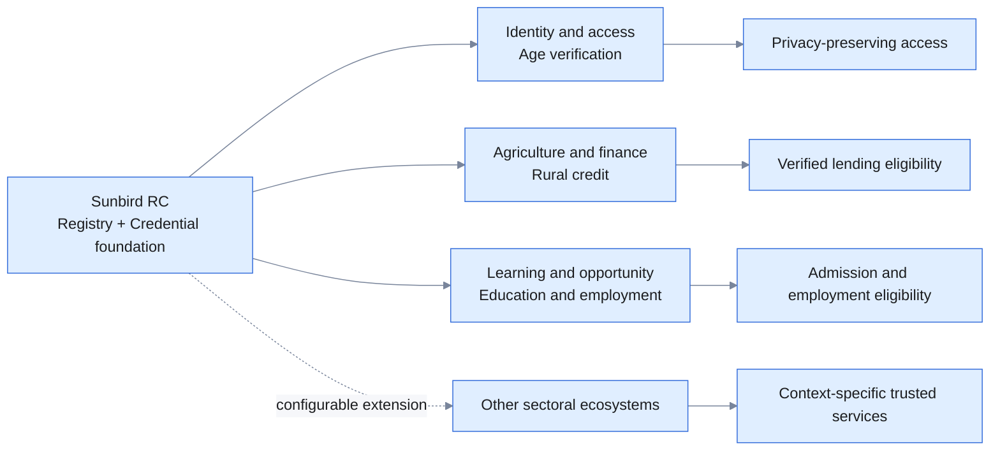
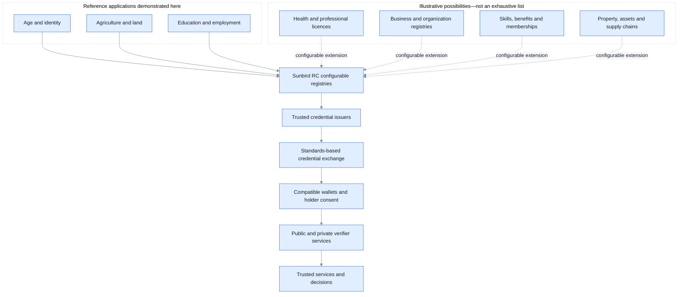

# Applications of Sunbird RC

Sunbird RC is a configurable, domain-neutral foundation for building trusted
digital registries and credential ecosystems. It can help an authority define
and maintain structured records, establish who is permitted to manage or attest
to those records, and issue verifiable credentials that can be used beyond the
original registry.

The core idea is simple: an authoritative record should not remain trapped
inside one database or portal. With the right governance and consent, a trusted
fact from that record can become a portable credential. A person or organization
can hold the credential in a compatible wallet and present the required
information to another service, which can verify its origin and integrity before
making a decision.

Sunbird RC does not prescribe a particular sector, registry model, credential or
service rule. An ecosystem configures these elements for its own context:

- the people, organizations, assets or entitlements being registered;
- the authorities responsible for those records;
- the credentials that may be issued from them;
- the wallets and standards profiles used for exchange;
- the parties trusted to verify the credentials; and
- the policies or services that use verified information.

Age verification, rural credit, and education-to-employment are the first
reference applications presented here. They were chosen because together they
show progressively richer combinations of registries, issuers, credentials,
wallet interactions and verifier decisions. They are examples intended to
expand the imagination—not a catalogue that limits where Sunbird RC can be
used.

## Sectoral implementations: one foundation, different ecosystems

A sectoral implementation is not a generic demonstration with different labels.
Each sector has its own authoritative institutions, records, identifiers, trust
relationships, credential claims, user journeys and service rules. Sunbird RC
supplies common Registry and Credential capabilities; the ecosystem configures
them around its real institutional context.

The three reference implementations show this clearly:

- **Identity and access:** an identity authority maintains citizen records and
  enables privacy-preserving age evidence for an age-restricted service.
- **Agriculture and finance:** farmer and land authorities maintain independent
  records and issue credentials that a lender verifies before applying a
  rural-credit policy.
- **Education and employment:** Schools, Colleges and Universities issue
  qualifications that a learner reuses for admission and job screening.

Across these sectors, Sunbird RC provides the configurable foundation. Each
implementation retains its own governance, issuers, data boundaries, disclosure
rules and service outcomes.



The same patterns can be explored for professional licences, health-worker or
facility registries, social-protection entitlements, business registrations,
skills and training, property and asset records, memberships, supply-chain
participants, environmental attestations, and other domains that depend on
trusted records and portable evidence.

## Reference implementation status

All three reference implementations are complete and available in the
repository's `main` baseline.

| Reference implementation | Status | Evidence |
|---|---|---|
| Age verification | **Complete** | [Evidence summary](../evidence/01-age/README.md) |
| Agriculture and rural credit | **Complete** | [Evidence summary](../evidence/02-agriculture/README.md) |
| Education and employment | **Complete** | [Evidence summary](../evidence/03-education/README.md) |

The status describes these bounded reference applications. It does not imply
that the wider production ecosystems, governance arrangements or external
source-system integrations described in each guide have been implemented.



## Explore the applications

### Privacy-preserving age verification

Enable a person to prove that they satisfy an age requirement without sharing
their date of birth or complete identity record.

[Explore age verification →](use-cases/age-verification.md)

### Farmer and land credentials for rural credit

Allow a bank to verify farmer registration, land ownership and crop information
from independent authoritative sources before calculating farm-credit
eligibility.

[Explore agriculture and rural credit →](use-cases/agriculture-rural-credit.md)

### Education credentials for admission and employment

Allow a learner to obtain credentials from a School, College and University and
reuse them for postgraduate admission and employment screening.

[Explore education and employment →](use-cases/education-employment.md)

## The common pattern

```text
Authoritative ecosystem records
          ↓
Sunbird RC Registry
          ↓
Trusted credential issuer
          ↓
Standards-compatible wallet
          ↓ holder consent and selected information
Verifier or relying service
          ↓
Trusted service, entitlement or decision
```

The domain, actors and policy may change, but the reusable pattern remains:

1. Model authoritative records using Registry schemas.
2. Connect authenticated users to the correct records.
3. Issue verifiable credentials derived from those records.
4. Store credentials in a standards-compatible wallet.
5. Request and present only the information required for a purpose.
6. Verify trust and integrity before providing a service or applying a rule.

## What Sunbird RC contributes

- Configurable registries for domain-specific records.
- Credential schemas and issuer configurations.
- Credentials derived from authoritative registry data.
- Independent issuer identities and signing boundaries.
- Standards-based issuance and presentation interfaces.
- Reusable verification capabilities that can precede sector-specific decisions.

The demonstrations use a customized open-source wallet. The integration is
standards-aligned; any selected wallet must still be tested against the exact
protocol and credential profile used by an implementation.

## From application to implementation

Each application guide explains:

- the problem being addressed;
- the actors and their responsibilities;
- the records and credentials involved;
- how Sunbird RC enables the solution;
- the experience being demonstrated; and
- how another ecosystem can adapt the pattern.

After understanding an application, use the linked reference implementation and
Sunbird RC resources to examine schemas, configuration, APIs and working code.

> These applications use synthetic data and simplified policies to demonstrate
> capabilities. They are reference patterns, not production deployments or
> sector-policy recommendations.
