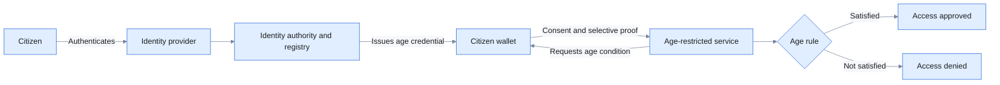

# Privacy-preserving age verification

## The problem

Age checks are required across many everyday services: access to age-restricted
content or venues, purchase of regulated goods, enrollment in age-bound
programmes, and eligibility for benefits or services. In most of these cases,
the service needs a simple answer—whether the person is above or below a defined
age—not the person's complete identity.

The common approach is to ask the person to upload, photocopy or display a
government identity document. That document usually reveals far more than the
transaction requires, including the person's full name, exact date of birth,
address, photograph and identity number. The service may then retain a copy,
creating an avoidable store of sensitive personal data.

The approach is also difficult to use consistently in digital journeys. A
verifier may have to inspect a document image, calculate age, detect tampering
and decide whether the issuing authority can be trusted. Citizens repeatedly
share the same sensitive document with unrelated services, while issuing
authorities have little control over how copies are interpreted or retained.

The real-world need is therefore for a reusable digital proof that answers the
specific age question, can be verified as originating from an authoritative
source, remains under the citizen's control and does not expose unnecessary
identity information.

## Ecosystem actors

| Actor | Responsibility | Illustrative global examples |
|---|---|---|
| Citizen or resident | Authenticates, obtains the credential and controls its presentation | A resident using a national eID, civil identity or another government-recognized identity account |
| Identity authority | Maintains authoritative identity information and enables a trusted age assertion | UIDAI/Aadhaar in India, a national civil-registration or population-registry authority, or an identity authority participating in a national eID ecosystem |
| Identity provider | Authenticates the person and connects the session to the correct source record | Singpass in Singapore, an eIDAS-notified national eID scheme in Europe, Aadhaar authentication where legally permitted, or another public identity provider; Keycloak performs this role in the demonstration |
| Credential issuer | Converts the authoritative age fact into a signed, wallet-held credential | A national identity authority, civil-registration authority, licensing authority or another legally authorized issuer |
| Wallet | Stores the credential, displays requests and obtains consent | A standards-compatible government, commercial or open-source digital credential wallet |
| Age-restricted service | Requests the minimum age evidence and makes the access decision | A regulated-goods retailer, online platform, venue, gaming service, benefits programme or public service |

The examples show how roles may be mapped in different jurisdictions; they do
not imply participation in or endorsement of this demonstration. For reference,
[UIDAI operates India's Aadhaar identity ecosystem](https://www.uidai.gov.in/en/about-uidai/unique-identification-authority-of-india.html),
while [Singpass is Singapore's national digital identity provider](https://docs.developer.singpass.gov.sg/docs/introduction/overview-of-singpass).

## The application

The application turns an authoritative identity record into a reusable,
purpose-specific digital credential. After authenticating the citizen, the
National Identity Authority locates the correct record and derives an age
condition such as “over 18.” It issues an **Age Verification Credential**
directly to a wallet controlled by the citizen.

The wallet becomes the citizen's point of control. It stores the credential and
can use it with different services without asking the identity authority to
participate in every transaction. The citizen can see who is requesting
information, understand what is being requested and decide whether to share it.

When an age-restricted service initiates a request, it asks for the required age
condition rather than an identity document. With the citizen's consent, the
wallet creates a selective presentation. The service cryptographically verifies
the issuer, credential, holder and transaction before applying its access rule.

The result is a simpler experience for the service and the citizen: the service
receives a trustworthy answer, the authority remains the source of the fact, and
the citizen avoids disclosing an exact date of birth or complete identity
record. The same model works across a website using a QR code and a mobile
application using a deep link.

## How Sunbird RC enables it

### Registry

A Sunbird RC Registry models the synthetic citizen records used by the identity
authority. The authenticated National ID resolves to the correct record, but the
National ID does not have to be disclosed to the verifier.

### Credential

The credential issuer derives an age condition from the registry record and
issues a holder-bound SD-JWT credential. The credential can selectively disclose
the required assertion while withholding other claims.

### Verification

The verifier checks the credential signature, trusted issuer, holder binding,
audience, nonce and transaction state before applying the age-access rule.

## Watch the age-verification application

> **Demonstration video placeholder** — Show direct wallet issuance, web QR
> verification, same-device deep-link verification, the consent screen, minimum
> disclosure, and both approved and denied outcomes. Replace this block with the
> public video URL when available.

## Experience demonstrated

### Obtain the credential

1. The citizen opens the wallet and selects the National Identity Authority.
2. The citizen authenticates through Keycloak.
3. The authority finds the corresponding synthetic citizen record.
4. The credential is issued directly to the wallet—no issuance QR is used.
5. The citizen reviews and stores the credential.

### Verify across devices

1. A website displays an age-verification QR code.
2. The citizen scans it with the wallet.
3. The wallet displays the verifier and requested information.
4. The citizen consents to disclose the age condition.
5. The website verifies the response and displays **APPROVED** or **DENIED**.

### Verify on the same device

1. A mobile application requests age verification.
2. A deep link opens the wallet.
3. The citizen reviews and consents.
4. The wallet returns the presentation to the application.
5. The application verifies it and displays the result.

## Information design

| Used by the issuer | Shared with the verifier | Withheld |
|---|---|---|
| Authenticated National ID and citizen record | Required age condition | Date of birth, address and unrelated identity details |

## How to adapt this pattern

1. Identify the authoritative organization that can determine the required age
   condition.
2. Model or connect the authoritative citizen records.
3. Define a purpose-specific credential and avoid unnecessary identity claims.
4. Configure authentication-to-record mapping.
5. Establish trusted issuer identifiers and keys.
6. Select a wallet compatible with the chosen OpenID4VCI, OpenID4VP and SD-JWT
   profiles.
7. Configure verifier requests for only the required assertion.
8. Add the jurisdiction's actual age policy, privacy notice, retention policy,
   revocation model and operational controls.
9. Test positive, negative, refusal, tampering and replay cases before deployment.

## Explore the implementation

- [Sunbird RC documentation](https://docs.sunbirdrc.dev/)
- [Reference implementation repository](https://github.com/pallakartheekreddy/sunbird-rc-reference-implementations)
- [Age implementation](https://github.com/pallakartheekreddy/sunbird-rc-reference-implementations/tree/main/iterations/01-age)
- [Age demonstration evidence](https://github.com/pallakartheekreddy/sunbird-rc-reference-implementations/tree/main/docs/evidence/01-age)

> Add the public customer demonstration video and live-demo link here when they
> are ready for external access.
