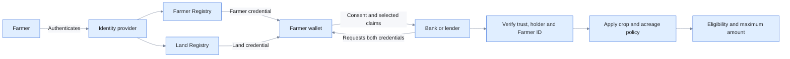

# Farmer and land credentials for rural credit

> **Status: complete reference implementation.** The
> two-credential rural-credit journey uses synthetic farmer and land data. See the
> [committed evidence](https://github.com/Sunbird-RC/sunbird-rc-reference-implementations/tree/main/docs/evidence/02-agriculture).

## The problem

Farmers often need seasonal or working-capital credit to purchase seed,
fertilizer, equipment and other inputs. A lender assessing that application may
need to establish several facts: that the applicant is a registered farmer, that
the applicant owns or controls agricultural land, what crop is cultivated, and
how much land is under cultivation.

Those facts rarely come from one system. A Farmer Registry may be maintained by
an agriculture authority, while ownership and land metadata are maintained by a
land-administration authority. Each uses its own identifiers, records and
operational processes. The lender must determine whether the records are valid,
current, issued by the right authority and related to the same applicant.

In a document-based process, farmers may collect certificates or extracts from
multiple offices and submit copies to every lender. Banks must inspect the
documents, reconcile names or identifiers and manually enter crop and acreage
information. This increases processing time, creates opportunities for altered
or mismatched records, and may require farmers to disclose identity and land
details that are not needed for the credit decision.

Direct integration between every bank and every source registry is another
possible approach, but it creates tightly coupled point-to-point connections and
requires authoritative systems to be online for every loan application. The
real-world need is a trusted and portable way for farmers to bring verified
facts from independent authorities into a lender's digital journey, with clear
consent and minimum disclosure.

## Ecosystem participants, coverage and boundaries

The reference application connects trusted farmer and land evidence to a sample
lending decision. It demonstrates the credential inputs, not an entire
agricultural-finance operating model.

| Participant | Ecosystem responsibility and examples | Coverage in this reference implementation | Production responsibility or integration remaining |
|---|---|---|---|
| Farmer | Obtains and presents evidence; a smallholder, tenant, cooperative member or commercial farmer | **Demonstrated:** synthetic farmers hold two credentials and consent to presentation | Enrolment, assisted access, corrections, recovery and grievance support |
| Identity provider | Authenticates National ID and connects the farmer to records | **Represented:** Keycloak performs deterministic synthetic mapping | Approved identity integration, assurance and account lifecycle |
| Farmer Registry and agriculture authority | Maintain farmer registration and programme information; typically a ministry, agency or cooperative | **Represented:** a separate Sunbird RC entity supplies the Farmer credential | Authoritative onboarding, stewardship, crop-data sources and corrections |
| Land Registry | Maintains land identity, ownership and acreage; typically a cadastral, deeds or titles authority | **Represented:** a separate entity and issuer supply one ownership record per farmer | Title integration, tenure complexity, leases, disputes and change events |
| Farmer and Land issuers | Issue independently trusted, role-specific credentials | **Demonstrated:** separate identities and issuer-role trust are verified | Onboarding, production keys, revocation, expiry and trust-registry operation |
| Wallet provider | Stores both credentials and presents selected claims together | **Demonstrated:** the wallet preserves issuer separation and consent | Production assurance, recovery, device security and interoperability testing |
| Bank or lender | Verifies evidence and applies credit policy; for example a rural bank, cooperative or microfinance provider | **Demonstrated:** a mock bank calculates a maximum amount | KYC/AML, risk, pricing, underwriting, sanction, disbursement, repayment and servicing |
| Agricultural and financial governance | Define recognized authorities, crop rates and regulated lending rules | **Not integrated:** static configuration represents trust and rates | Governed rates, regulation, audit, appeals, liability and operations |



## How this reference application uses Sunbird RC

| Sunbird RC capability | Use in this application |
|---|---|
| **Registry — source records** | Separate Farmer and Land Registry entities contain synthetic farmer, ownership, acreage and crop records. National ID mapping connects the authenticated person to the correct Farmer ID and Land ID. |
| **Credential — VC issuers** | Independently configured Farmer and Land issuers create the **Farmer Identity Credential** and **Land Ownership Credential** from their respective Registry records. |
| **Compatible wallet** | Stores both credentials and presents selected claims together with consent. It does not merge or become authoritative for the two source registries. |

> All farmer, land and identity records used here are synthetic. Production
> deployment requires integration with the responsible farmer and land
> authorities, their governed source systems and operating processes.

## The application

The application allows each authority to remain responsible for its own records
while giving the farmer a portable form of evidence. After authentication, the
Farmer Registry resolves the farmer's record and issues a **Farmer Identity
Credential**. The Land Registry independently resolves the corresponding land
record and issues a **Land Ownership Credential**. Each credential is signed by
its own issuer and stored in the farmer's wallet.

The credentials have complementary roles. The Farmer credential establishes
registered-farmer status. The Land credential establishes ownership status and
provides the crop and cultivated acreage used by the demonstration policy. A
common Farmer ID makes it possible to establish that the two credentials refer
to the same farmer without exposing the National ID used for authentication.

When the farmer applies for credit, the bank requests only the facts required
for that application. The wallet shows the request and presents selected claims
from both credentials only after consent. The bank verifies the issuing
authority for each credential, confirms that both credentials are controlled by
the same holder, checks the Farmer ID correlation and rejects any invalid or
mismatched combination before evaluating eligibility.

Once the evidence is trusted, a separate lending-policy component determines
the outcome. In the demonstration, active ownership and a supported crop are
required, and the maximum amount is calculated from verified cultivated acreage
and the configured crop rate. This illustrates how authoritative evidence can
feed a transparent service rule without placing lending logic inside the
registries or wallet.

For farmers, the result is reusable evidence under their control. For source
authorities, it preserves clear data and issuer boundaries. For banks, it
provides verifiable inputs that can reduce manual document handling while still
allowing each lender to define its own governed credit policy.

## How Sunbird RC enables it

### Farmer Registry

A Farmer entity represents the authoritative farmer record. The issuer uses the
authenticated National ID to locate the correct Farmer ID and derive the Farmer
Identity Credential.

### Land Registry

A separate Land entity represents ownership, land area, cultivated area and crop
metadata. Its issuer independently maps the authenticated person to the farmer's
land record and derives the Land Ownership Credential.

### Independent credentials

The registries use different issuer identities and keys. This enables the bank
to verify not only that each credential is signed, but also that the correct
authority issued the correct credential type.

### Multi-credential verification

The bank requests both credentials in one transaction. Verification confirms:

- both credential signatures and approved algorithms;
- the trusted issuer for each credential role;
- control by the same wallet holder;
- matching Farmer IDs;
- audience, nonce and transaction integrity; and
- disclosure of only the required claims.

The lending rule runs only after these checks succeed.

## Credential lifecycle and sample data

> **Synthetic demonstration data:** The identifiers and values below are
> fictional. They are not real people, land records or production credential
> schemas.

| Credential stored in wallet | Illustrative claims |
| --- | --- |
| Farmer Identity Credential | `farmerId: FMR-20481`, `registrationStatus: ACTIVE` |
| Land Ownership Credential | `landId: LAND-78432`, `farmerId: FMR-20481`, `ownershipStatus: ACTIVE`, `cultivatedAcres: 3.5`, `cropType: WHEAT` |

```text
Farmer Registry ──issues Farmer credential──┐
                                            ├─► Farmer wallet
Land Registry ─────issues Land credential───┘        │ consent
                                                     ▼
Bank receives selected farmer, ownership, crop and acreage claims
                                                     │
                                                     ▼
Verify issuers + signatures + holder + matching Farmer ID
                                                     │
                                                     ▼
Apply the bank's crop-and-acreage lending rule
```

National ID, name, address, date of birth and unrelated land information are
not presented. Verification establishes trustworthy inputs; the lending policy
then determines eligibility and maximum loan.

## Watch the rural-credit application

The committed demonstration covers Farmer and Land credential issuance, wallet
persistence, bank QR verification, minimum disclosure, loan calculation,
ineligible, mismatched-record and refusal outcomes.

[Watch the committed Agriculture demonstration](https://github.com/Sunbird-RC/sunbird-rc-reference-implementations/blob/main/docs/evidence/02-agriculture/Agriculture-Rural-Credit-Showcase-31Aug.mp4)

## Experience demonstrated

### Obtain farmer evidence

1. The farmer selects the Farmer Registry in the wallet.
2. Keycloak authenticates the farmer.
3. The registry maps the National ID to the Farmer record.
4. The farmer reviews and stores the Farmer Identity Credential.

### Obtain land evidence

1. The farmer selects the Land Registry.
2. The Land Registry resolves the corresponding owned land record.
3. The farmer reviews ownership, crop and acreage information.
4. The Land Ownership Credential is stored in the same wallet.

### Apply for farm credit

1. The mock bank requests both credentials through a QR code.
2. The wallet shows the bank, credentials and requested claims.
3. The farmer consents.
4. The bank verifies and correlates the credentials.
5. The bank displays eligibility and, when eligible, the maximum loan.

## Demonstration policy

    valid registered-farmer credential
    AND valid active land-ownership credential
    AND matching Farmer ID
    AND supported crop
    → maximum loan = cultivated acres × crop rate per acre

The application distinguishes:

- **ELIGIBLE** with a maximum demonstration amount;
- **NOT ELIGIBLE** when verified facts fail the lending rule;
- **REJECTED / UNABLE TO VERIFY** when trust or correlation fails; and
- **NO DATA SHARED** when the farmer refuses.

## Information design

| Needed by the bank | Kept private |
|---|---|
| Farmer ID, registered status, ownership status, crop and cultivated acreage | National ID, name, address, date of birth, Land ID, total land metadata and unrelated credentials |

## How to adapt this pattern

1. Identify the authorities responsible for farmer and land records.
2. Define separate registry schemas, stewardship and access boundaries.
3. Establish a safe National ID-to-Farmer ID-to-Land ID mapping.
4. Define the credentials and minimum claims required by lenders.
5. Establish issuer onboarding, role-based trust and key governance.
6. Configure wallet discovery to show only relevant ecosystem issuers.
7. Define the lender's policy separately from credential verification.
8. Replace the demonstration crop rates with governed policy data.
9. Add production revocation, expiry, audit, privacy, security and operational
   controls.
10. Test mismatched records, wrong issuers, wrong holders, tampering, refusal and
    incomplete evidence.

## Explore the implementation

- [Sunbird RC documentation](https://docs.sunbirdrc.dev/)
- [Reference implementation repository](https://github.com/Sunbird-RC/sunbird-rc-reference-implementations)
- [Deployment and demo guide](../../deployment-and-demos.md)
- [Agriculture demonstration evidence](https://github.com/Sunbird-RC/sunbird-rc-reference-implementations/tree/main/docs/evidence/02-agriculture)

> Add the public customer demonstration video and live-demo link here when they
> are ready for external access.
