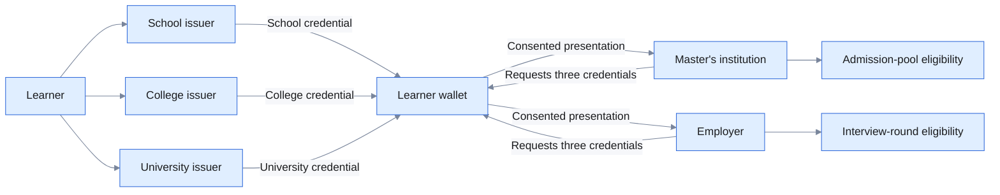

# Education credentials for admission and employment

> This application is being built. The page describes the intended solution and
> will be updated with working evidence after the demonstration is accepted.

## The problem

Education records are created over many years and by different institutions. A
learner may complete school under one authority, a diploma at a college and a
degree at a university. Later, the learner must assemble this history when
applying for postgraduate study, employment, scholarships, professional
registration or other opportunities.

Today, this often depends on paper certificates, scanned copies, institution
portals and manual verification. Universities and employers must determine
whether every document is genuine, whether the issuing institution is
recognized, whether the records all belong to the same applicant and whether
the qualifications satisfy a particular rule. Verification can involve emails,
phone calls or separate connections to multiple institutions.

This creates delays for applicants and receiving organizations. It can also
encourage excessive data collection: a verifier may receive complete
certificates, student identifiers and academic information even when it needs
only completion status, qualification, field and a threshold result. Fraudulent
or altered certificates are difficult to identify consistently, while genuine
learners repeatedly prove the same history to different organizations.

The same credentials also have different meanings in different contexts. A
university may require higher academic thresholds to accept an application into
an admission pool, while an employer may use a different threshold to select a
candidate for the first interview round. The real-world need is trusted,
portable education evidence that can be reused across purposes without merging
institutional registries or disclosing the learner's complete education record.

## Ecosystem actors

| Actor | Responsibility | Illustrative global examples |
|---|---|---|
| Learner | Authenticates, obtains credentials and controls their presentation | A student moving between school, vocational education, university, postgraduate study and employment—within one country or across borders |
| School or awarding body | Maintains school-completion records and issues School Certificates | A public or private school, national examination board, State/provincial board, Cambridge-style awarding body or ministry of education |
| College or training provider | Maintains diploma, vocational or undergraduate records and issues credentials | A community college, vocational institute, polytechnic, autonomous college or university-affiliated college |
| University | Maintains degree records and issues University Degrees | A recognized public, private, federal, national or international university |
| Recognition or accreditation body | Establishes whether an institution, programme or qualification is recognized | A national qualifications authority, accreditation agency, UGC or professional council in India, ENIC-NARIC centre in Europe, or the relevant regulated-profession body |
| Identity provider | Authenticates the learner and supports issuer-side record lookup | An institution account, national eID such as Singpass or Aadhaar where legally permitted, or another government identity service; Keycloak performs this role in the demonstration |
| Wallet | Stores the three credentials and presents selected information | A standards-compatible learner wallet; Europass in Europe and DigiLocker/NAD in India are real-world examples of digital academic-credential services, with different technical profiles |
| Postgraduate institution | Verifies education history and evaluates admission-pool eligibility | A university, graduate school or other recognized higher-education institution receiving Master's applications |
| Employer | Verifies education history and evaluates interview-round eligibility | A private company, public-sector organization, international employer, nonprofit or government recruitment body |

These examples illustrate role categories across jurisdictions and do not imply
participation in the reference implementation. The
[European Digital Credentials for Learning](https://europass.europa.eu/en/european-digital-credentials-learning)
show how institutions can issue credentials to a learner wallet for education
and employment use, while India's
[DigiLocker National Academic Depository](https://nad.digilocker.gov.in/about)
provides another model for authentic digital academic awards.



## The application

The application creates a connected learner journey while preserving the
independence of the participating institutions. A School, College and University
each maintain their own authoritative records and issue their own credential.
The learner authenticates, requests each credential and stores all three in one
wallet.

Each credential represents a different stage of the learner's history. The
School Certificate records school completion and result. The College Diploma
records qualification and specialization. The University Degree records degree
level, field of study, completion and result. A common Learner ID allows the
credentials to be correlated during verification, while the National ID and
institution-specific Student IDs remain part of issuer-side processing rather
than routine disclosure.

For a Master's application, the institution requests the three relevant
credentials and the minimum claims needed for its published rule. After the
learner consents, the application verifies the credentials and checks the
School, College and University thresholds. An eligible result means the
application can enter the admission process and await the admission list; it
does not mean that a place has been awarded.

For a job application, the same credentials are reused with a different
verifier and a different rule. The job provider verifies the education history,
requires completed School and College credentials and applies the relevant
University threshold. An eligible result advances the candidate to interview
round one; it does not represent final selection or employment.

This demonstrates an important ecosystem property: trusted credentials can be
issued once by their authoritative institutions and reused many times by the
learner. Verification capabilities remain common, while each receiving
organization controls its own purpose, disclosure request and decision policy.
Institutions do not have to share one database, and verifiers do not need
permanent point-to-point access to every source system.

## How Sunbird RC enables it

### Education registries

Separate School, College and University entities maintain institution-specific
records. Each institution remains authoritative for the credential it issues.

### Credential issuance

Each institution issues a holder-bound credential derived from its record:

| Issuer | Credential | Example information |
|---|---|---|
| School | School Certificate | Learner ID, completion, year and percentage |
| College | College Diploma | Learner ID, qualification, specialization, completion, year and percentage |
| University | University Degree | Learner ID, degree level, field, completion, year and percentage |

### Correlation without excess identity data

National ID supports authentication and issuer-side lookup. A Learner ID links
the three credentials during verification. Institution-specific Student IDs do
not need to be disclosed.

### Reuse for different purposes

The wallet can present the same credentials to different verifiers. Verification
of signatures, issuers, holder and correlation is reusable; the Master's and job
rules remain separate application policies.

## Credential lifecycle and sample data

> **Synthetic demonstration data:** The learner, identifiers, results and
> qualifications below are fictional. They are not real education records or
> production credential schemas.

| Credential stored in wallet | Illustrative claims |
| --- | --- |
| School Certificate | `learnerId: LRN-31009`, `status: PASSED`, `percentage: 72` |
| College Certificate | `learnerId: LRN-31009`, `status: PASSED`, `percentage: 68` |
| University Degree | `learnerId: LRN-31009`, `degree: BSc Computer Science`, `status: COMPLETED`, `percentage: 74` |

```text
School + College + University issue independently
                    │
                    ▼
       Three credentials in learner wallet
                    │ learner reviews request and consents
          ┌─────────┴─────────┐
          ▼                   ▼
 Master's application     Job application
          │                   │
          └──── verify trust, holder and matching Learner ID
                              │
                              ▼
                 Apply purpose-specific eligibility rule
```

The same credentials can be presented to different verifiers, but each
verifier requests and uses only the claims needed for its published purpose.
Successful verification does not itself mean admission or employment.

## Watch the education application

> **Video placeholder — in development** — The final video should show all three
> credentials being issued and stored, followed by a Master's application and a
> job application using the same credentials. It should include eligible,
> ineligible, verification-rejection and refusal outcomes. Replace this block
> only after the working application is accepted.

## Intended experience

### Obtain the credentials

1. The learner authenticates through the wallet.
2. The learner selects the relevant School, College and University issuers.
3. Each institution resolves its own record and issues its credential.
4. The learner reviews and stores all three credentials.

### Apply for a Master's programme

1. The institution requests the three education credentials.
2. The learner reviews the institution, purpose and requested claims.
3. The learner consents to presentation.
4. The verifier validates all credentials and applies the Master's rule.
5. An eligible applicant is accepted for consideration and waits for the
   admission list. The result is not an admission decision.

### Apply for a job

1. The job provider requests the education credentials.
2. The learner reviews and consents.
3. The verifier validates the credentials and applies the job rule.
4. An eligible candidate is selected for interview round one. The result is not
   an employment offer.

## Demonstration policies

### Master's application

- School completed with at least 60%.
- College completed with at least 60%.
- Relevant completed Bachelor's degree with at least 70%.

### Job application

- School and College completed/passed.
- Relevant completed Bachelor's degree with at least 60%.

## How to adapt this pattern

1. Identify recognized institutions and the records each controls.
2. Define institution and learner identifiers without exposing national identity
   information unnecessarily.
3. Model the School, College and University schemas.
4. Define credentials appropriate to the education system.
5. Establish accreditation, issuer onboarding and trust governance.
6. Configure the wallet for the participating institutions.
7. Define minimum disclosure separately for each application purpose.
8. Keep admission, ranking, recruitment and employment rules outside credential
   verification.
9. Add production revocation, expiry, corrections, appeals, privacy and audit
   controls.
10. Test forged issuers, mixed learners, incomplete education histories, refusal
    and policy-boundary outcomes.

## Explore the implementation

- [Sunbird RC documentation](https://docs.sunbirdrc.dev/)
- [Reference implementation repository](https://github.com/pallakartheekreddy/sunbird-rc-reference-implementations)
- [Education application inputs](https://github.com/pallakartheekreddy/sunbird-rc-reference-implementations/tree/iteration/education-03-employment/iterations/03-education)

The reference implementation and public demonstration links will be added after
the application is completed and accepted.
